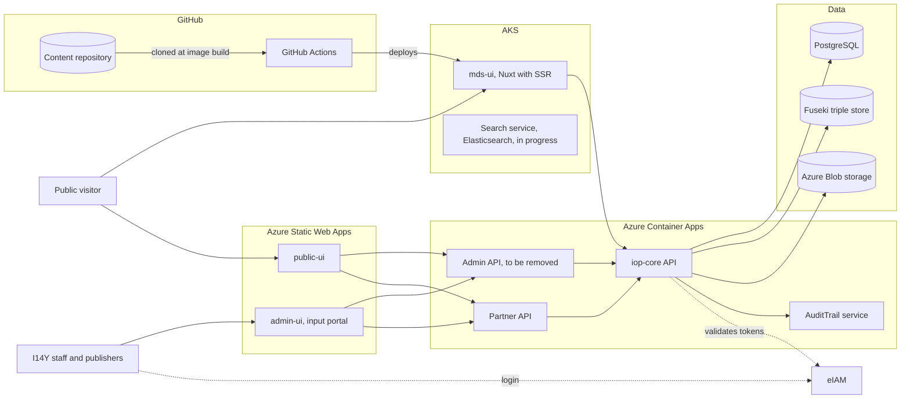
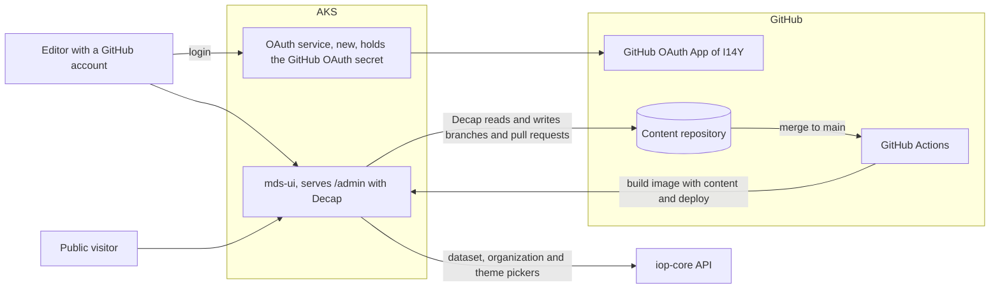
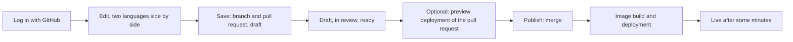
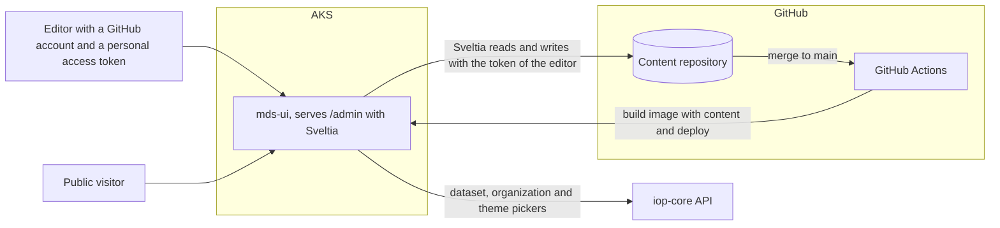
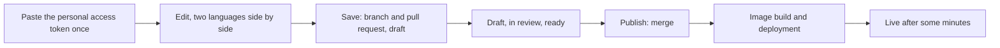
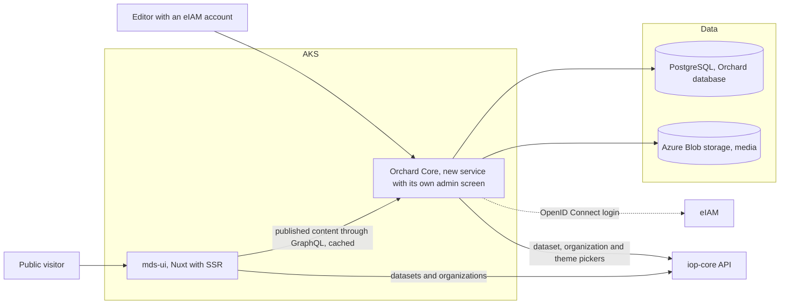
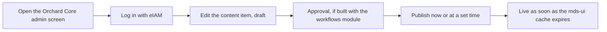
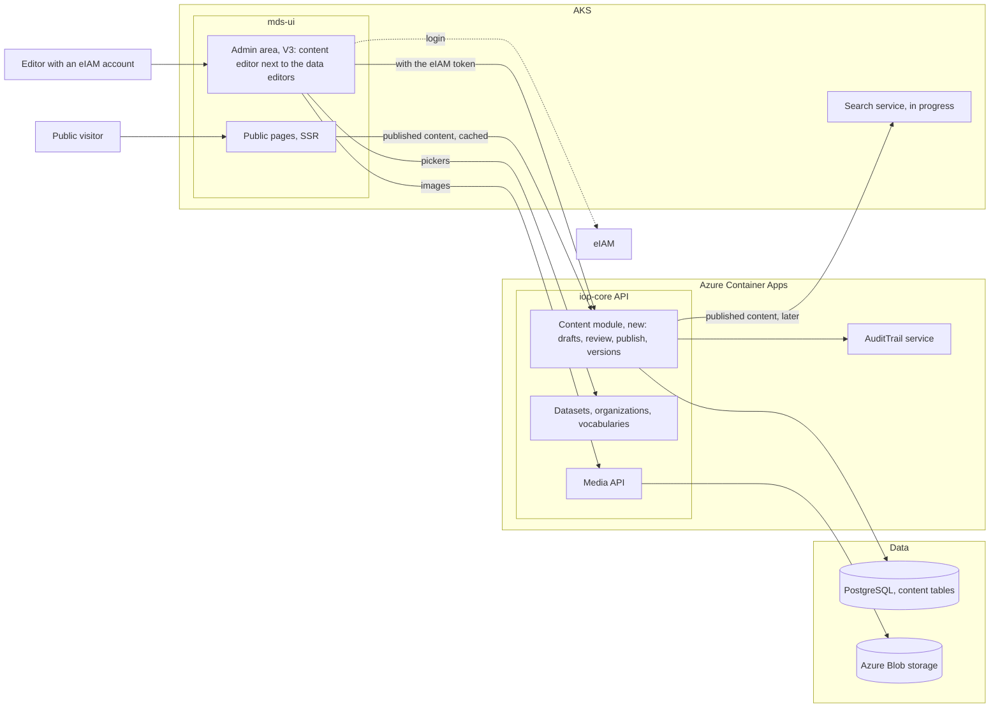
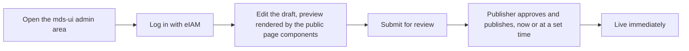

# CMS options for mds-ui

Status: comparison for discussion, 2026-10-08. This page compares the options; it doesn't recommend one.

mds-ui shows four kinds of editorial content: pages (including the home page), the handbook, the blog and
showcases, each in German, French, Italian and English. The body text is Markdown with MDC blocks such as
`::OdsCard{…}`, rendered by the Vue components in `app/components/content/`. Showcases also refer to datasets,
organizations, themes and content types.

Today the content lives in a separate GitHub repository and editors change it with Decap CMS at `/admin`. Decap no
longer works: editors logged in through the original team's Netlify project, and the showcase fields search the
original team's piveau. Version 1 of mds-ui ships without a CMS, whatever is chosen here; editors change the Markdown
files on GitHub until a CMS is back. In the plan (`docs/NextSteps.md`), the CMS and showcase submissions come back in V4,
after the admin area and eIAM login of V3.

The four options:

1. **Decap CMS**, kept, with what belonged to the original team replaced.
2. **Sveltia CMS**, replacing Decap and reading the same configuration.
3. **Orchard Core**, a database-backed CMS that I14Y runs on AKS.
4. **Content module of our own**: content stored by iop-core, edited in the admin area of mds-ui (V3).

Effort figures are rough estimates in person-days, for comparing the options.

## Constraints

- **Content is not put into the I14Y main repository.** Options 1 and 2 keep the separate content repository;
  options 3 and 4 move content into a database.
- **Nothing run by the original team is used**, and we have none of their accounts: no Netlify, no piveau, no
  GitHub Apps of theirs.
- **License policy:** `DENY_LICENSES` in `.github/workflows/quality-gates.yml` bans GPL, LGPL, AGPL, SSPL and MPL
  licenses.

## What the CMS has to cover

Today's set-up, in `src/admin/config.yml`, `src/admin/` and `content.config.ts`:

- **Four collections:** pages, handbook (nested with `parent` and `after`), blog, showcases.
- **Four languages**, one file per language (German by default); editors see two languages side by side.
- **Editorial workflow:** draft, in review, ready, published.
- **Nine editor components** for blocks inside the Markdown body (`src/admin/editors/`): section, cards, hero search,
  latest news, latest showcases, uploaded document, uploaded video, YouTube, Vimeo.
- **Four showcase pickers** (`src/admin/*Component.jsx`): datasets, organizations, themes and content types. They
  search the original team's piveau and must point to iop-core in every option.
- **Media** such as images and documents.
- **Scheduling and visibility:** `publicationDate`, `active` and `pinned` fields.
- **Showcase submissions** from the public, reviewed by editors before publishing.

## I14Y architecture today

The starting point for all four options. mds-ui is shown where it's planned to run.

- public-ui and admin-ui call the Admin API and the Partner API, which both call iop-core. The Admin API will be
  removed, and admin-ui will be rebuilt in mds-ui in V3.
- iop-core validates eIAM tokens and provides the user (`GET /api/Users/current`) and permissions (`AllowActions`).
- iop-core already has what a CMS needs underneath: PostgreSQL, file storage on Azure Blob (`/api/Media`), and the
  AuditTrail service.
- mds-ui gets the editorial content by cloning the content repository when its image is built, so every content
  change means a new build and deployment.

## Option 1: Decap CMS

Decap (formerly Netlify CMS, MIT) is a React application that runs in the editor's browser and writes to the GitHub
content repository through GitHub's API. It needs a server only for one step of the GitHub login: exchanging the
login code for a token, which requires the OAuth client secret. The original team used Netlify for that step.

### Architecture

### Editorial workflow

Public showcase submissions would be created as pull requests by a GitHub App on the server, labelled as drafts,
so they appear in the same workflow board.

### What has to be built

| Task | Estimate |
|---|---|
| GitHub OAuth App in the I14Y GitHub organization; a small OAuth service on AKS, secret in Key Vault; `base_url` in `config.yml` | 2–3 days |
| Rewrite the four React pickers to search iop-core instead of piveau | 3–5 days |
| Testing | 1 day |
| License exception for `@vercel/stega` (MPL-2.0); `dompurify` can be used under Apache-2.0 | approval |
| Showcase submissions through a GitHub App | 5–8 days |
| **Total** | **about 11–17 days** |

### Pros and cons

| Pros | Cons |
|---|---|
| Configuration, the nine editor components and the editorial workflow work as they are | Editors need GitHub accounts with write access to the content repository; no eIAM login |
| Mature and widely used | A service holding a secret has to be run for the login |
| No change to how mds-ui renders content | A React application inside a Vue project, plus Bootstrap and Node polyfills used only by the editor |
| Content history and review come from Git | Slow, dated interface; the preview doesn't look like the website |
| | Every publish needs an image build and deployment |
| | Three packages on the I14Y license deny list |
| | `decap-server`, used for local editing, pulls in `simple-git` 3.36.0, which `npm audit` reports as critical (development only) |

## Option 2: Sveltia CMS

Sveltia (MIT) is a rewrite of Decap that reads the same `config.yml`. It's shipped as one bundle, without React as a
dependency of the project. Editors can sign in with a GitHub personal access token, which needs no server.

### Architecture

A GitHub OAuth login is possible as well; it then needs the same OAuth service as option 1.

### Editorial workflow

The same as Decap, except for the login:

### What has to be built

| Task | Estimate |
|---|---|
| Replace `decap-cms-app` with Sveltia in `src/admin/index.jsx`, check the compatibility messages for `config.yml` | 1 day |
| A guide for editors on creating a fine-grained token for the content repository only | 0.5 day |
| Rewrite the four pickers as Sveltia field types searching iop-core. `registerWidget` remains as an alias of `registerFieldType`, but the props differ from Decap's | 3–5 days |
| Test the nine editor components: load and save an entry, check the Markdown is unchanged | 1 day |
| License scan of the bundle; make sure machine translation is off | 0.5–1 day |
| Showcase submissions through a GitHub App | 5–8 days |
| **Total** | **about 11–16 days** |

### Pros and cons

| Pros | Cons |
|---|---|
| Same `config.yml` and editor components as today | Version 0.x (latest v0.232.0), frequent releases, mostly one maintainer |
| No login service and no secret with personal access tokens | The editorial workflow is new; v0.230.1 fixed a medium-severity vulnerability in it |
| React and Bootstrap leave the project | Editors need GitHub accounts and have to create and renew tokens; the token is stored in the browser |
| Faster interface and stronger support for several languages; the project reports over 160 sites moved to it from Netlify or Decap CMS | Third-party code inside the bundle isn't seen by the CI license check |
| Content history and review come from Git | Every publish needs an image build and deployment |
| | Can send content to external machine translation services if configured |

## Option 3: Orchard Core

Orchard Core (BSD-3) is a CMS built on ASP.NET Core, the same platform as iop-core. It stores content in a database
through YesSql, which has providers for PostgreSQL, SQL Server, MySQL and SQLite. It includes an OpenID Connect
client (for an eIAM login), roles and permissions, draft and publish with versions, scheduled publishing, a
workflows module, an audit trail module, Azure Blob media storage, Markdown fields, and GraphQL for headless use.

### Architecture

mds-ui reads published content at request time and keeps rendering Markdown with `<MDC>`, so the existing block
components stay. Public showcase submissions would create draft content items in Orchard Core through an
endpoint built for it.

### Editorial workflow

### What has to be built

| Task | Estimate |
|---|---|
| Deploy on AKS with PostgreSQL and Azure Blob | 2–3 days |
| Content types for pages, handbook, blog and showcases, in four languages | 4–6 days |
| eIAM login through the OpenID Connect client, roles | 1–2 days |
| Approval with the workflows module | 2–4 days |
| Pickers for datasets, organizations and themes from iop-core | 3–5 days |
| mds-ui reads content from Orchard Core instead of Nuxt Content: navigation, handbook tree, blog list, search | 5–8 days |
| Import the existing Markdown files | 2–3 days |
| License and security review | 2–3 days |
| Showcase submissions endpoint | 3–5 days |
| **Total** | **about 24–39 days** |

### Pros and cons

| Pros | Cons |
|---|---|
| eIAM login in the free version; editors need no GitHub account | One more service on AKS with its own database, backups and upgrades |
| Same platform as iop-core (.NET) | A second admin screen next to the mds-ui admin area |
| Markdown fields keep the existing content and the `<MDC>` rendering | The admin screen is aimed at developers; editors need training |
| Publishing is live without a build; scheduled content is filtered on the server | Approval has to be modelled with the workflows module |
| Showcase relations can be queried at runtime | Roles are kept in Orchard Core and mapped from eIAM, apart from iop-core's |
| Versions and an audit trail are included | The media module uses ImageSharp, whose version 3 license is Apache-2.0 only in some cases; to be confirmed by legal |
| | Content pages depend on Orchard Core being up |

## Option 4: Content module of our own, embedded in mds-ui

Content becomes a module of iop-core, stored in its PostgreSQL. Editors work in the admin area that V3 adds to mds-ui
for the features of admin-ui, with the same eIAM login.

### Architecture

Drafts and live content are stored apart: editors change drafts, and the public endpoints only read published
snapshots, filtered by publication time on the server. Showcases keep their relations as identifiers of datasets,
organizations and themes, so "showcases using this dataset" and counts per organization are database queries.
Public showcase submissions go straight into a review queue in the admin area.

### Editorial workflow

### What has to be built

| Task | Estimate |
|---|---|
| iop-core content module: data model, four languages, versions, review and publish states, public and admin endpoints, caching, full-text search | 12–18 days |
| Editor in the mds-ui admin area: forms, a Markdown editor that inserts the MDC blocks, preview, review and submission queues, iop-core pickers | 12–18 days |
| Public pages read the content endpoints instead of Nuxt Content: navigation, handbook tree, blog, showcase filters, search | 5–8 days |
| Showcase submissions endpoint and queue | 3–4 days |
| Migration script and tests | 3–5 days |
| **Total** | **about 35–50 days** |

It needs the V3 admin area and its eIAM login first.

### Pros and cons

| Pros | Cons |
|---|---|
| One admin area and one login for content and data | The largest development effort; needs both the backend and the frontend team |
| Uses what iop-core has: eIAM roles, PostgreSQL, Blob storage, AuditTrail | Changes iop-core, so it can only come with V3 |
| No new service, no new secret, no GitHub accounts | Review states, versions and diffs have to be built instead of coming from Git |
| Live immediately; scheduled content never leaves the server early | A Vue Markdown editor with block insertion has to be chosen (license to check) and integrated |
| The preview is the real page | Risk of the module growing into a general-purpose CMS |
| Showcase relations, reverse lookups and submissions fit naturally | Content pages depend on iop-core being up; caching is needed |

## Side by side

### Ease of use for editors

| | Decap | Sveltia | Orchard Core | Own module |
|---|---|---|---|---|
| Account needed | GitHub, with write access to the repository | GitHub, plus a personal access token | eIAM | eIAM |
| Where they edit | `/admin` on mds-ui | `/admin` on mds-ui | A separate Orchard Core admin screen | The mds-ui admin area, next to data editing |
| Editing interface | Form, dated | Form, faster | Form, aimed at developers | Built for our four content types |
| Preview | Not the real page | Not the real page | Not the real page unless configured | The real page |
| Two languages side by side | Yes | Yes | Not by default | To be built |
| MDC blocks | The nine blocks as today | The nine blocks as today | Markdown fields; blocks typed by hand unless a custom editor is added | Block insertion built into the editor |
| Review | Workflow board | Workflow board | Through the workflows module | Review queue |
| From publish to live | Minutes: build and deployment | Minutes: build and deployment | Seconds: cache expiry | Immediately |

### Difficulty for the team

| | Decap | Sveltia | Orchard Core | Own module |
|---|---|---|---|---|
| Effort, including showcase submissions | 11–17 days | 11–16 days | 24–39 days | 35–50 days |
| Skills | JavaScript, React | JavaScript | .NET, Orchard Core | .NET and Vue |
| New services | OAuth service | None | Orchard Core and its database | None |
| Changes to iop-core | Showcase submissions only | Showcase submissions only | None | A new module |
| Changes to mds-ui rendering | None | None | Read from Orchard Core instead of Nuxt Content | Read from iop-core instead of Nuxt Content |
| Migration of existing content | None | None | Import Markdown into Orchard Core | Import Markdown into iop-core |
| Depends on | Nothing | Nothing | Nothing | The V3 admin area and eIAM login |
| Main unknowns | None significant | Compatibility of our nested editor components; bundle licenses | Editor training, approval set-up, ImageSharp license | Choice of Markdown editor, scope control |

### Risks

| | Decap | Sveltia | Orchard Core | Own module |
|---|---|---|---|---|
| License | Exception needed for `@vercel/stega` | Bundle to be scanned | ImageSharp v3 terms to be confirmed | Markdown editor to be checked |
| Maturity and maintenance | Stable, slow maintenance | 0.x, mostly one maintainer | Stable since 2019 | Our own code to maintain |
| Credentials | OAuth secret in a service; GitHub tokens in editors' browsers | GitHub tokens in editors' browsers | eIAM, as for other I14Y tools | eIAM, as for other I14Y tools |
| Where drafts and submissions are stored | github.com | github.com | I14Y database | I14Y database |
| Personal data of submitters | In pull requests and Git history, hard to delete | In pull requests and Git history, hard to delete | In Orchard Core, can be deleted | In iop-core, can be deleted |
| Scheduled content | Part of the build; may reach browsers before its date | Same | Filtered on the server | Filtered on the server |
| Content pages when a backend is down | Still served, baked into the image | Still served, baked into the image | Depend on Orchard Core and the cache | Depend on iop-core and the cache |
| Change of terms by a vendor | Low | Low | Low | None |

### Fit with the I14Y architecture

| | Decap | Sveltia | Orchard Core | Own module |
|---|---|---|---|---|
| eIAM | No | No | Yes | Yes |
| iop-core PostgreSQL, Blob storage, AuditTrail | Not used | Not used | Own database and audit trail; Blob storage usable | Used |
| Separate content repository | Yes | Yes | No: Orchard Core's database | No: iop-core's database |
| The V3 admin area | Separate | Separate | Separate | Part of it |
| Showcase relations to datasets | Text in front matter, queried at build time | Text in front matter, queried at build time | Identifiers, queried at runtime | Identifiers, queried at runtime |

## Questions that decide between the options

- Who edits the content, and how often? Are they comfortable with GitHub?
- Must editors work without GitHub accounts, with their eIAM login?
- Must every change be reviewed by a second person before it's published?
- How fast must a change be live after publishing?
- May drafts and submissions, including submitters' email addresses, be stored on github.com?
- Should content editing be in the same admin area as data editing?
- Which skills and how much capacity do the backend and frontend teams have for V4?
- Is a license exception acceptable (option 1), and is the ImageSharp case cleared (option 3)?
- May content pages depend on a backend being available, with caching as the safeguard?

## Sources

- [Decap CMS: backends overview](https://decapcms.org/docs/backends-overview/)
- [Self-hosting Decap CMS without Netlify](https://blog.devgenius.io/a-step-by-step-guide-to-self-hosting-decap-cms-5425ab44abca)
- [Sveltia CMS](https://sveltiacms.app/en/) · [GitHub](https://github.com/sveltia/sveltia-cms) ·
  [releases](https://github.com/sveltia/sveltia-cms/releases)
- [Sveltia CMS: custom field types](https://sveltiacms.app/en/docs/api/field-types) ·
  [custom editor components](https://sveltiacms.app/en/docs/api/editor-components)
- [Sveltia CMS is feature complete (DEV Community)](https://dev.to/rdjarbeng/sveltia-cms-is-feature-complete-time-to-switch-from-decap-cms-formerly-netlify-cms-ifg)
- [Orchard Core](https://www.orchardcore.net/) · [GitHub](https://github.com/OrchardCMS/Orchardcore) ·
  [Data module](https://docs.orchardcore.net/en/main/reference/modules/Data/)
- [YesSql providers (NuGet)](https://www.nuget.org/packages/YesSql.Provider.CosmosDb)
- [ImageSharp license (NuGet)](https://packages.nuget.org/packages/SixLabors.ImageSharp/3.1.3/License) ·
  [ImageSharp changes license (i-programmer)](https://www.i-programmer.info/news/80-java/15822-imagesharp-changes-license-leaves-net-foundation.html)
