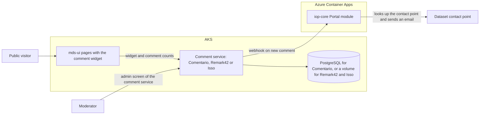
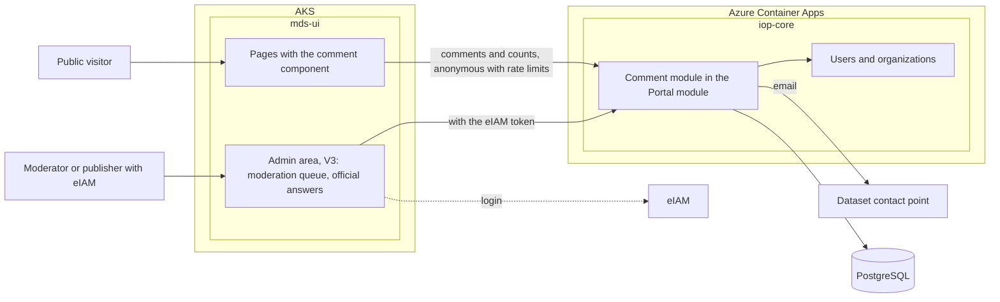
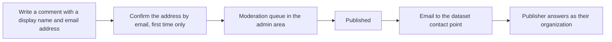

# Comments (switched off)

mds-ui had comments on its pages, provided by [Hyvor Talk](https://talk.hyvor.com). Hyvor Talk is a paid hosted
service and isn't open source, and mds-ui used the account of the original project, which I14Y has no access to.
The comments are switched off
and the Hyvor Talk code is removed until I14Y decides on a comment service of its own (gap G11 in
[iop-core-gaps.md](iop-core-gaps.md)).

This page describes what the feature did and how it was built, so that it can be added back, and compares the
options for a replacement: [Replacing Hyvor Talk](#replacing-hyvor-talk).

To see the removed code, find the commit that removed it and show the files of the commit before:

```bash
git log --oneline -- frontend/mds-ui/server/lib/webhooks/hyvor.ts
git show <commit>~1:frontend/mds-ui/server/lib/webhooks/hyvor.ts
```

## What it did

| Feature | Where |
|---|---|
| A comment thread at the end of the page, in the language of the page | Dataset page, blog posts, handbook pages, showcase pages |
| The number of comments of each dataset | Dataset search results, list and card view |
| Ratings of showcases (part of the Hyvor Talk thread), written back to piveau as `schema:ratingValue` | Showcase pages. The rating was not shown anywhere in mds-ui. |
| An email to the publisher of a dataset when a new comment was published | Server webhook `POST /api/webhooks/hyvor` |

## Page ids

Each thread was identified by a page id. The old comments are stored under these ids in the Hyvor Talk account of
the original project. I14Y has no access to that account, so the old comments can't be imported, and a new service
starts without comments. The ids are still a usable naming scheme for the new threads.

| Page | Page id | Set in |
|---|---|---|
| Dataset | `dataset-{dataset id}`. The dataset id is now the DCAT identifier; under piveau it was the piveau id. | Dataset page, dataset list items |
| Blog post | `blog-{content id}` | `app/pages/blog/[year]-[month]/[slug].vue` |
| Handbook page | `handbook-{content id}` | `app/components/handbook/OdsHandbookPage.vue` (`app/pages/handbook/[...slug].vue` passed the same id) |
| Showcase | The content stem without the language, for example `showcases/{name}` | `app/pages/showcase/[id].vue` |

## Pages

The package `@hyvor/hyvor-talk-vue` wraps the Hyvor Talk web components for Vue. Nuxt had to transpile it and its
dependency (`build.transpile: ['@hyvor/hyvor-talk-vue', '@hyvor/hyvor-talk-base']`).

**Comment thread.** `OdsPage.vue` had an optional prop `commentsId`. Pages that wanted comments set it, and
`OdsPage` showed the thread after the page content:

```vue
<script setup lang="ts">
import { Comments } from '@hyvor/hyvor-talk-vue'

const { locale } = useI18n()
const { comments: { websiteId } } = useRuntimeConfig().public
</script>

<template>
  <!-- after the content of the page -->
  <div v-if="commentsId" class="container">
    <Comments :website-id="websiteId" :page-id="commentsId" :page-language="locale" />
  </div>
</template>
```

The dataset page doesn't use `OdsPage`. It had the same `<Comments>` at the end of its main section, with the page id
`` `dataset-${dataset.id}` ``.

**Comment counts.** Each dataset list item (`OdsDatasetListItem.vue`, `OdsDatasetCardListItem.vue`) showed the count
in its meta line:

```vue
<span class="meta-info__item">
  <CommentCount :page-id="`dataset-${props.dataset.id}`" :language="locale" />
</span>
```

`OdsDatasetList.vue` then loaded the counts of all datasets on the page in one request. After mounting and after each
update, it waited up to 1 second for the script of Hyvor Talk and called it:

```ts
import { waitUntil } from 'async-wait-until'

async function loadCommentCounts() {
  await waitUntil(() => window.hyvorTalkCommentCounts, 1000)
  window.hyvorTalkCommentCounts!.load({ 'website-id': 15455 })
}

onMounted(loadCommentCounts)
onUpdated(loadCommentCounts)
```

The website id was hard-coded here. When the script wasn't there in time, the browser console showed
"Timed out after waiting for 1000 ms".

## Server: webhook `POST /api/webhooks/hyvor`

Hyvor Talk called this endpoint for new comments and ratings
(`server/api/webhooks/hyvor.post.ts`, logic in `server/lib/webhooks/hyvor.ts`).

1. **Signature.** The HMAC-SHA256 of the raw body with `hyvor.webhookSecret`, as hex, had to equal the `X-Signature`
   header. Otherwise: 400.
2. **Body.** A missing body: 400.
3. **Switch.** With `hyvor.webhooksEnabled` false, the endpoint returned 204 and did nothing.
4. **Events.** `comment.create` and `comment.update` went to the comment handler, `rating.created` and
   `rating.updated` to the rating handler. Other events: 400.

**Comment handler: notify the publisher.** It sent an email only when all of these were true:

- `hyvor.publisherNotificationTemplateId` is set;
- the comment is a top-level comment, not a reply;
- the comment is published, either right away (empty `history`) or by a moderator (the first `history` entry has
  `type: 'moderation'` and `new_status: 'published'`).

The dataset id was the page id without `dataset-`. The handler loaded the dataset from piveau, took its first contact
point and sent a Listmonk transactional email to the contact point's email. Without an email, it returned an error.

```ts
await listmonk.transactional.send({
  template_id: publisherNotificationTemplateId,
  subscriber_email: publisher.email,
  subscriber_mode: 'external',
  data: {
    page: { url: comment.page.url, title: comment.page.title },
    publisher: { name: publisher.name },
    author: { email: comment.user.email },
    comment: { body: comment.body_html },
  },
})
```

The Listmonk template uses these `data` fields. In iop-core, the contact points of a dataset are
`DcatDatasetModel.contactPoints` (`VCardModel`: name `fn`, email `hasEmail`).

**Rating handler: write the rating to piveau.** The page id had to match `showcase/{id}`. The handler loaded the
showcase from the piveau hub-repo and replaced its `schema:ratingValue` with the average rating of the page. Showcase
pages used `showcases/{name}` as page id, which doesn't match this pattern (the tests used `showcase/…`), so the
ratings were probably never written.

## Configuration

| Runtime config | Environment variable | Default | Meaning |
|---|---|---|---|
| `public.comments.websiteId` | `NUXT_PUBLIC_COMMENTS_WEBSITE_ID` | `15455` | Hyvor Talk website, the account of the original project. `k8s/deployment.yaml` read it from the config map `public-endpoints`, key `comments-website-id`. |
| `hyvor.webhooksEnabled` | `NUXT_HYVOR_WEBHOOKS_ENABLED` | `false` | Whether the webhook does anything |
| `hyvor.webhookSecret` | `NUXT_HYVOR_WEBHOOK_SECRET` | empty | Secret for the `X-Signature` check |
| `hyvor.publisherNotificationTemplateId` | `NUXT_HYVOR_PUBLISHER_NOTIFICATION_TEMPLATE_ID` | `5` (`9` in `k8s/deployment.yaml`) | Listmonk template of the publisher email |

## Tests

These tests were removed with the code:

- `server/tests/webhooks/hyvor.test.ts` (mocha). Comment handler:
  - an email is sent for a new top-level comment;
  - no email for a reply, for a pending comment, or without a template id;
  - an email is sent when a pending comment is approved;
  - real delivery through Listmonk to Mailpit.

  Rating handler: errors without a page or with a wrong page id, and the showcase is updated.
- `server/tests/webhooks/hyvor.test.n3` (api-tuner). A wrong or missing signature returns 400; rating created, rating
  updated, comment created.
- `server/tests/webhooks/payloads/`: example payloads of Hyvor Talk. `signature.js <file>` calculated the
  `X-Signature` of a payload file.

The test dataset `hyvor-test` in `server/tests/hub-repo/` is kept, because the subscription tests use it too.

## Replacing Hyvor Talk

This section compares four ways to bring comments back. It doesn't recommend one. In the plan
(`docs/NextSteps.md`), comments come back in V4, after the admin area and eIAM login of V3. Effort figures are rough estimates
in person-days, for comparing the options.

Whatever is chosen, two things stay the same:

- **Commenters have no eIAM account.** eIAM is for staff. The public comments anonymously or with an account of the
  comment system. Where a system supports OpenID Connect, eIAM can serve the moderators, not the commenters.
- **Someone has to moderate**: remove spam and abuse, and make sure questions get answered. A thread full of
  unanswered questions does more harm to trust than no thread.

### The options

**Comentario** (MIT, Go). A self-hosted comment server and the continuation of Commento. It stores data in PostgreSQL
or SQLite, offers threaded Markdown comments, moderation and statistics, and signs users in with local accounts,
social logins and, since version 3.9, a generic OpenID Connect provider. The container image is published on GitLab's
registry; there's no official Helm chart.

**Remark42** (MIT, Go). A mature, widely used comment engine. It stores data in an embedded database file (BoltDB),
so it runs as a single instance with a persistent volume. Commenters can sign in with social accounts or email, or
comment anonymously; administrators moderate in the comment widget.

**Isso** (MIT, Python). The simplest of the three. It stores data in SQLite, also a single instance with a persistent
volume. Comments are anonymous, with an optional name and email address. It can hold new comments for moderation and
has an endpoint that returns the counts of several pages at once.

**A module of our own.** Comments become part of the iop-core Portal module, stored in PostgreSQL. The comment
widget is a Vue component in mds-ui; moderation happens in the mds-ui admin area (V3). A publisher logged in with
eIAM can answer on the datasets of their own organization, marked as an official answer, because iop-core knows the
organizations of the user (`GET /api/Users/current-agents`).

### Architecture

The three existing products fit in the same way:



A module of our own has no extra service:



### Commenting flow

With an existing product, the flow is the product's own. With a module of our own, it would be:



### Side by side

| | Comentario | Remark42 | Isso | Module of our own |
|---|---|---|---|---|
| License | MIT | MIT | MIT | — |
| Technology | Go | Go | Python | .NET in iop-core, Vue in mds-ui |
| Storage | PostgreSQL or SQLite | Embedded file (BoltDB), persistent volume | SQLite, persistent volume | iop-core PostgreSQL |
| Instances | Several, with PostgreSQL | One | One | Like iop-core |
| How commenters identify | Local accounts, social logins, OpenID Connect | Social logins, email, or anonymous | Anonymous, optional name and email | Name and email, address confirmed by email |
| Moderators | In Comentario; can log in with eIAM through OpenID Connect | In the comment widget, as administrators | Moderation queue, approval by the administrator | In the mds-ui admin area, with eIAM |
| Official answers by publishers | Only with separate accounts in Comentario | Only with separate accounts in Remark42 | No | Yes: eIAM user and organization |
| Counts in the dataset list | To be checked | Count endpoint; one request for many pages to be checked | Endpoint for several pages at once | A query, or a stored count per thread |
| Email to the dataset contact point | Through a webhook to iop-core, if Comentario offers one (to be checked) | Through a webhook to iop-core (to be checked) | No webhook; iop-core would have to poll | Inside iop-core |
| Look and accessibility | The product's widget, styled with CSS | The product's widget | The product's widget | Our own component, in the federal design system |
| UI in German, French, Italian and English | To be checked | To be checked | To be checked | Ours to provide |
| Extra service on AKS | Yes, plus a database | Yes, plus a volume and backups | Yes, plus a volume and backups | No |
| Personal data | In Comentario's database | In Remark42's file | In Isso's database | In iop-core, with our own retention and deletion |
| Ready-made features (editing, notifications, spam handling) | Yes | Yes | Few | To be built |
| Depends on | The email sending of the Portal module | The email sending of the Portal module | The email sending of the Portal module | The email sending of the Portal module and the V3 admin area |

### Effort

| Task | Comentario | Remark42 | Isso | Module of our own |
|---|---|---|---|---|
| Run the service on AKS: database or volume, backups | 2–3 | 2–3 | 1–2 | — |
| Login of moderators | 1–2 (eIAM) | 1 | — | in the admin area below |
| Comment widget on the dataset, blog, handbook and showcase pages | 2–3 | 2–3 | 2–3 | 5–8 (component, four languages, accessibility) |
| Counts in the dataset list | 1–2 | 1–2 | 1 | included above |
| Email to the dataset contact point | 2–3 | 2–3 | 2–4 | included in the backend |
| Backend: data model, endpoints, address confirmation, rate limits, notifications | — | — | — | 8–12 |
| Moderation queue in the admin area | — | — | — | 4–6 |
| Official answers by publishers | — | — | — | 2–3 |
| Spam protection, reporting, terms of use | — | — | — | 2–3 |
| Security and data protection review, tests | 1–2 | 1–2 | 1–2 | 2–3 |
| **Total (days)** | **about 9–15** | **about 9–14** | **about 7–12** | **about 23–35** |

### Pros and cons

| | Pros | Cons |
|---|---|---|
| Comentario | PostgreSQL, so backups follow the managed database; OpenID Connect for moderators; active development | Another service to run and upgrade; no official Helm chart; webhook and count features to be confirmed |
| Remark42 | Mature and widely used; flexible logins for commenters | Single instance with a database file; backups and the volume are ours to manage |
| Isso | Very simple; lowest effort | Few features; no webhook; single instance with SQLite |
| Module of our own | Official answers by publishers with eIAM; moderation in the same admin area as content and data; no extra service; comments attached to dataset identifiers; full control of design and accessibility | Highest effort; needs the email sending of the Portal module and the V3 admin area; spam, abuse and XSS protection are our responsibility; features of the products have to be built |

### Questions that decide

- Is a public discussion needed, or is a "contact the data provider" link to the dataset's contact point enough?
- Who moderates, and how fast must comments be checked?
- Must publishers be able to answer officially as their organization?
- Should moderation be in the mds-ui admin area or in a separate tool?
- May another service with personal data run on AKS, and who looks after its backups and upgrades?

## Adding comments back

1. Choose one of the options above (G11) and run it on I14Y's own infrastructure.
2. Put the thread back where `<Comments>` was: in `OdsPage.vue` behind a prop set by the blog, handbook and
   showcase pages, and on the dataset page.
3. Show the comment counts in the dataset list, loaded for all datasets of a page in one request.
4. Notify publishers as the comment handler did, with the contact points from iop-core. Send the email through the
   email sending of the iop-core Portal module, not Listmonk (see G12 in [iop-core-gaps.md](iop-core-gaps.md)).
5. With an existing product: check the signature of its webhooks, and keep a switch to turn them off. With a module
   of our own, there's no webhook: the notification happens inside iop-core.
6. Put the secrets in Key Vault (phase 8). Comments contain personal data of their authors, so the data protection
   review has to cover the chosen option.
